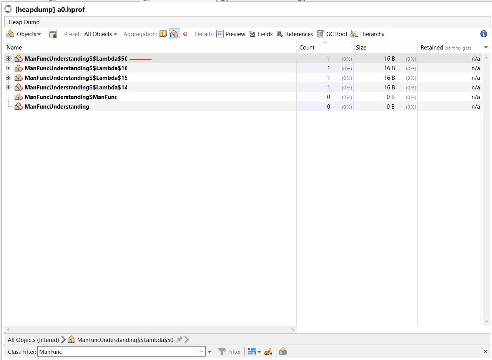
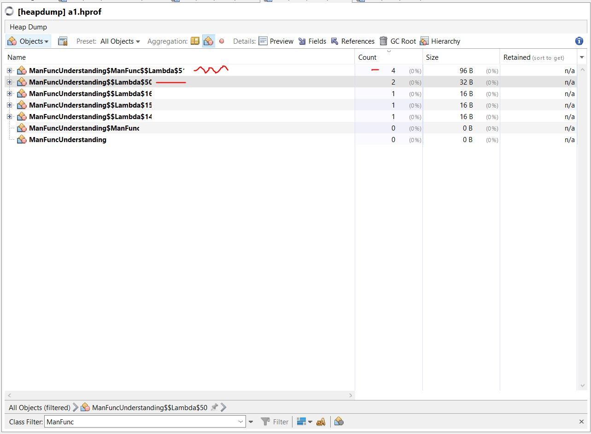
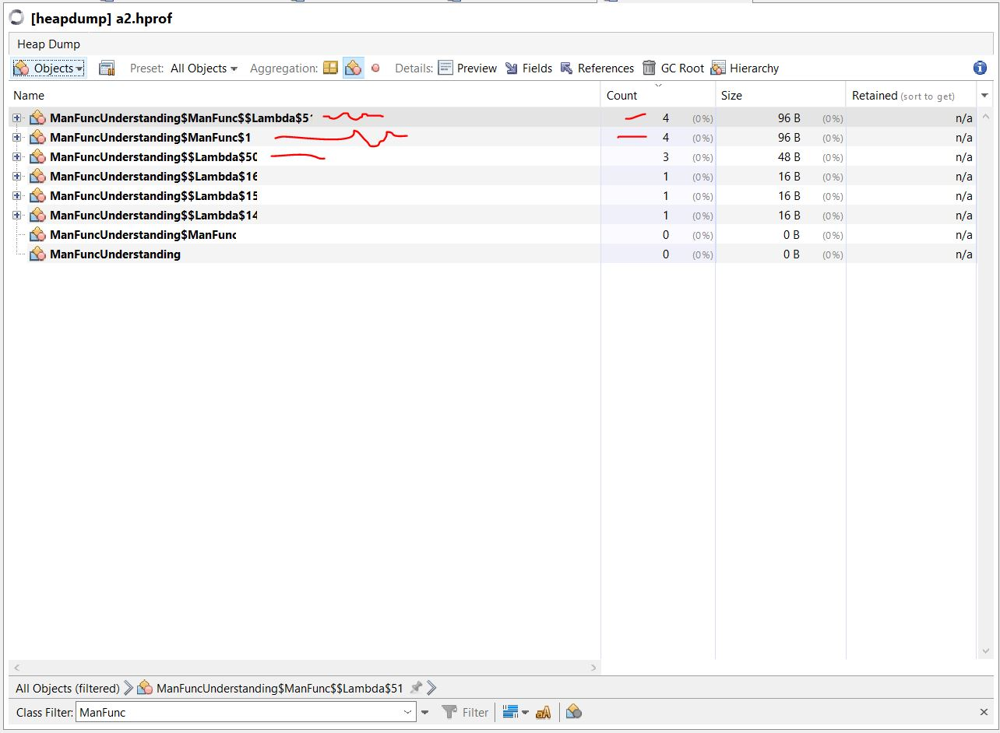

# music

ffmpeg must be present in the path

## Java 8 Func understanding check 

3 func created by declaring 3 local lambda as variables


4 func created (1 lambda obtained via function)



9 func in total; 4 via `andThen()` call; for more details check code



14 func in total; 4 via `andThenOld()` call, also new 4 are anonymous; for more details check code




### For python

```python3 -u .........music/src/py/music.py```

### For Java

java based lanterna project. Work in progress.
